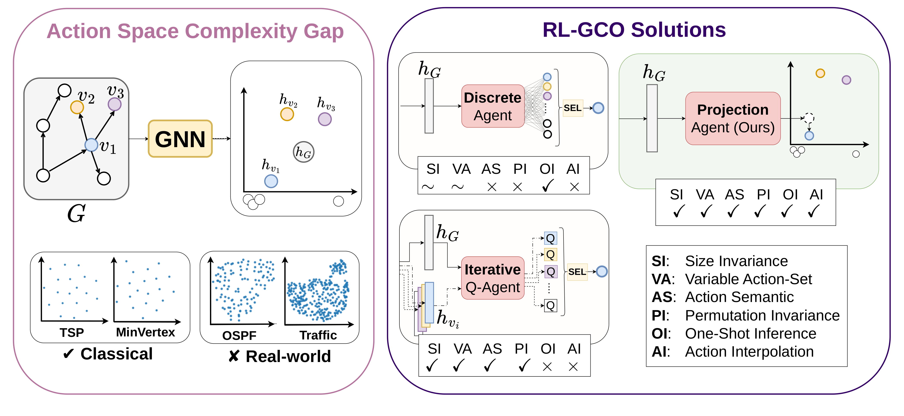
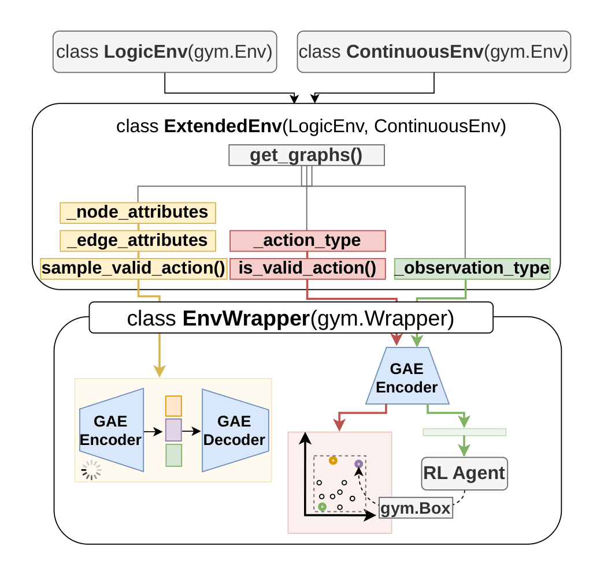

# LaGCO-RL: Reinforcement Learning in Latent Action Spaces for Graph Combinatorial Optimization

[](https://theses.fr/s371241)
[](https://opensource.org/licenses/MIT)
[](https://zenodo.org/records/20019625)

This project provides a modular framework for constructing **latent action spaces** and **semantically aligned latent observation spaces** for reinforcement learning (RL) in graph-based combinatorial optimization by using graph neural network (GNN) embeddings.

This project implements the advancements and extensions described in the paper:

> ### 📄 Paper Reference
> Franco Terranova, Guillermo Bernardez, Albert Cabellos-Aparicio, Nina Miolane, Abdelkader Lahmadi. _Projecting Latent RL Actions: Towards Generalizable and Scalable Graph Combinatorial Optimization_. Preprint (2026). 

Check for the `REPRODUCIBILITY.md` file to find detailed instructions to reproduce all results from the paper, including generalization and scalability experiments.


<p align="center">
  <a href="docs/images/overview.pdf">
    
  </a>
</p>

LaGCO-RL supports several GCO benchmark problems, ranging from linear node decision variables to more realistic structured and super-linear decision variables, thereby addressing the **action-space complexity gap** in existing benchmarks. 
It also enables the seamless integration of new tasks by simply defining the environment logic and feature extraction process.
Furthermore, LaGCO-RL supports multiple **RL-based GCO solutions**, including standard discrete approaches, iterative Q-agents, and the projection-based RL agent proposed in this work, whose main features are summarized in the figure above.

---

## 🚀 Installation

Install dependencies using:

```bash
conda env create -f environment.yml
```
Continue with the setup of proper configuration files needed by the library:
```
chmod +x setup.sh
./setup.sh
```
---


## 📁 Project Structure

### `envs/` – Environment Implementations

This directory contains example Gym environments for graph combinatorial optimization.

The framework is designed to be **modular and reusable**:

- First, define a standard Gym environment that captures the task logic.
- Then, create an extended version that inherits from both `ContinuousEnv` and your task-specific environment.

This extended environment enables the latent-space framework with minimal additional effort.

#### Required Components

The extended environment must define a few high-level elements:

<table border="0">
<tr>
<td valign="center">



</td>

<td valign="top">

- `get_graphs()`  
  Returns the graph representation of the environment, updated at each timestep.

- `_node_attributes`, `_edge_attributes`  
  Define node and edge encodings.

- `sample_valid_action()`  
  Samples valid actions during training.

- `_observation_type`  
  Specifies how embeddings are converted into observations.

- `_action_type`  
  Defines actions as combinations of graph elements.

- `is_valid_action(action)` *(optional)*  
  Dynamically filters invalid actions.

</td>
</tr>
</table>

The resulting action space is exposed as a continuous `gym.Box` aligned to the agent in case of projection-based methods, or as a discrete `gym.Discrete` in case of iterative methods.
The action space will instead be adapted accordingly for the iterative formulation, where the agent selects one graph element at a time after iterating across all options.

---

### Environment Registration

To register a new environment:

1. Add an entry in:
   ```
   envs/config/env_registry.yaml
   ```
   specifying the prefix and path to the environment class.

2. Create a corresponding:
   ```
   ENV_NAME_config.yaml
   ```
   containing initialization parameters.

---

## 🧪 Sample Generation

To generate environment samples, use scripts in the `generators/` folder.

1. Define parameter ranges in:
   ```
   generators/config/ENV_NAME_ranges.yaml
   ```
   to enable domain randomization.

2. Generate samples:

```bash
python3 random_generator.py -e ENV_NAME \
     -n NUM_SAMPLES \
     [--sizes SIZES] \ 
     [--train_pct TRAIN_PCT] [--val_pct VAL_PCT] [--test_pct TEST_PCT]  \
     [--max_sweeps MAX_SWEEPS] \ 
     [--split {random, complexity, smallest_train}]
```

Options allow you to:
- Control dataset size and splits  
- Fix or randomize instance sizes  
- Run heuristic sweeps to estimate best/worst solutions  

Samples will be stored in `data/env_samples/` along with logs and metadata.

---

## 🧠 Graph Autoencoder Training

After generating samples, train a GAE to learn node embeddings:

```bash
cd gae/
python3 train_gae.py -ti NUM_ITERATIONS \ 
        -e ENV_NAME \   
        [--load_envs ENVS_FOLDER] \
        [--model_type {gae, vgae}]  \
        [--num_runs RUNS] \    
        [--compare_random_init]
```

You can:
- Choose between GAE and VGAE  
- Run multiple training seeds  
- Compare against randomly initialized models  

Trained models will be saved in `gae/logs/`.
To use a trained GAE by default, update the root `config.yaml`.

---

## 🕹️ Agent Training & Testing

Agents can be trained on different observation-action formulations to compare learning effectiveness.

### Training

```bash
python3 train_agent.py -e ENV_NAME \
        -ti TRAIN_ITERATIONS \
        -algo {ppo, maskable_ppo, idqn, ...} \ 
        -at {projection, iterative, discrete} \
        [--GNN_observations] \   
        [--num_runs RUNS] \
        [--validation]
```

You can configure:
- RL algorithm (maskable_ppo for masked discrete approaches)
- Action space formulation  
- Use of GNN-based observations (possible for discrete solutions as an alternative to padding)
- Number of runs and validation  

Logs are stored in:
```
agents/logs/ENV_NAME/ALGORITHM_TYPE/
```

Training can be monitored using TensorBoard.

---

### Testing

```bash
python3 test_agent.py \
        -f AGENT_LOGS_FOLDER \
        [--load_default_test_envs] \
        [--load_custom_test_envs FOLDER]  \
        [-ne NUM_EPISODES] \
        [--last_checkpoint] [--val_checkpoints] \
        [--options {agent_performances, action_time}] \
        [--proto_knn K] [--proto_knn_path PATH]
```

Testing supports:
- Evaluation on unseen instances  
- Multiple checkpoints (last or validation-best)  
- Performance and timing metrics  
- Proto-KNN as an optional advanced decoding strategy to be used for projection-based methods instead of simple NN lookup

---

## Extra

Additional tools are available in the repository to perform advanced study on generalization and scalability, as well as scripts for hyper-parameters optimization and ablation studies.
The `experiments/` folder contains scripts to reproduce results from the paper. See `REPRODUCIBILITY.md` for details.

## Bibliographic Reference
If you use this code in your research, please cite the following paper:

```bibtex
@misc{terranova2026projectionRL,
  author={Terranova, Franco and Bernardez, Guillermo and Cabellos, Albert-Aparicio and Miolane, Nina and Lahmadi, Abdelkader},
  title={Projecting Latent RL Actions: Towards Generalizable and Scalable Graph Combinatorial Optimization}, 
  year={2026}
}
```

## Acknowledgments

- This project releases an extension of the DQN algorithm (iterative DQN) based on the original DQN implementation of Stable-Baselines3 (SB3), licensed under the MIT License: https://github.com/DLR-RM/stable-baselines3.
- Some data used for the synthetic generation of network scenarios are inspired from C-CyberBattleSim, licensed under the MIT License: https://github.com/terranovafr/C-CyberBattleSim
- This work has been partially supported by the French National Research Agency under the France 2030 label (Superviz ANR-22-PECY-0008). The views reflected herein do not necessarily reflect the opinion of the French government.

<div align="center">
  
  
  
  
</div>
<div align="center">
    
    
</div>
<br>